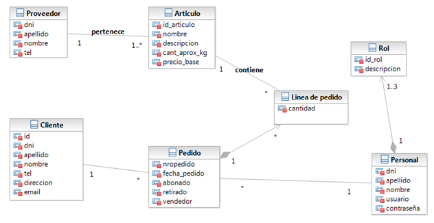

<b>Intro:</b>
 El mercado de concentración es un establecimiento donde se centraliza la comercialización mayorista de frutas y hortalizas para una ciudad, teniendo como clientes a supermercados, verdulerías, entre otros comercios. Cuenta con cientos de empresas denominadas “puestos” los cuales son independientes entre si y comercializan distintos tipos de alimentos. Tienen un funcionamiento similar para la venta de productos.

<b>Proceso de ventas:</b>
 El cliente llega al puesto, es atendido por un vendedor el cual asesora y toma el pedido en una boleta, los precios de los artículos son definidos por el vendedor para cada cliente. Una vez finalizado el pedido el cliente se dirije con la boleta a abonar por caja. Una vez abonado el pedido puede ser retirado si el mismo fue preparado cuando cliente lo desee.

<b>Requerimientos:</b>
 •	ABMC (todos): Cliente, pedido, articulo, proveedor, personal.
 •	CU complejo nivel resumen (1): “Gestion de mercaderías”
 •	Listado complejo (1): Clientes morosos
 •	Niveles de acceso (2): Vendedor/Cajero, Dueño de puesto
 •	Manejo de errores
 •	Publicar el sitio

<b>Modelo del dominio:</b>

 

<b>Casos de uso:</b>

<b>Caso de uso de sistema resumen reestructurado:</b> “Gestión de mercaderías”
 Actor primario: Vendedor
 Meta: Realizar venta
 Camino Básico:
 1 – Ingresan mercaderías provenientes de los proveedores. Se ejecuta CUU "Ingreso de mercaderías".
 2 – Cliente llega al puesto para realizar compra invocando CUU "Compra en puesto".
 3 – El dueño ingresa al sistema para obtener listado de deudores invocando CUU "Listar deudores".

<b>Caso de uso de usuario:</b> “Ingreso de mercaderías”
 Actor primario: Cajero
 Meta: Actualizar stock de mercaderías
 Camino básico:
 1 – Se ingresa en el depósito la nueva mercadería. El sistema lo registra.

<b>Caso de uso de usuario:</b> “Compra en puesto”
 Actor primario: Cliente
 Meta: Comprar artículos
 Precondiciones de sistema:Vendedor logueado
 Camino básico:
 1 – Cliente realiza compra de artículos, si el cliente es nuevo se lo registra, el vendedor valida disponibilidad y registra la venta en el sistema.
 2 – Cliente abona pedido por caja, el sistema registra pedido y emite comprobante.
 3 – Cliente retira pedido, el vendedor lo registra en el sistema.
 Caminos alternativos:
 1.a<durante> “Artículo o cantidad no disponible”
	 1.a.1 – El sistema muestra mensaje. Vuelta a paso 1
 2.a<durante> “El cliente no abona pedido y solicita fiado”
	 2.a.1 – El sistema registra deuda y emite comprobante.
	 2.a.2 – Ir a paso 3.
 2.b<durante> “El cliente no abona el pedido y se rechaza el fiado”
	 2.b.1 – El sistema cancela pedido. FCU
 2.c<posterior> “El cliente no retira el pedido”
	 3.a.1 – El sistema lo registra.

<b>Caso de uso de usuario:</b> “Listar deudores”
 Actor primario: Dueño
 Meta: Identificar deudores morosos
 Camino básico:
 1 – El dueño se loguea en el sistema ingresando usuario y clave. El sistema valida.
 2 – El dueño ingresa un monto minimo de deuda. El sistema emite listado con dni, apellido, nombre de los clientes que igualen o superen el monto ingresado.
 3 – El dueño selecciona enviar mail. El sistema envía email de notificación a cada uno de los clientes morosos.
 Caminos alternativos:
 1.a<durante> “Usuario o clave invalida”
	 1.a.1 – El sistema muestra mensaje “usuario o clave invalida”
	 1.a.2 – Vuelta a paso 1.
 2.a<durante> “No hay clientes deudores que superen el monto”
	 2.a.1 – FCU.

